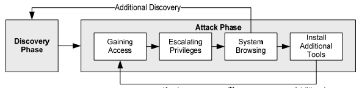

# On being a type-heavy Scheme programmer in InfoSec

or, **how I learnt to hate everything, & love better type systems.**

---


_Stefan Edwards_ (@lojikil on {github, twitter, lobste.rs, ...})
https://nvisium.com/about/#StefanEdwards

---
	


---


_Yes, we really tawk liek dis. Wanna fite 'bout it?_

---

# tl;dw

how do we use types, HOFs, &c. to model not safety, but rather violence?

takeaways: 
- support programming in the small
- whilst linearzing our attack flows
- resulting in _roughly_ the same code density
- with better understanding

mainly, let's talk tools (and play a CTF)

---

# Tools - I write _a lot_ of 'em

- {protocol, application} fuzzers
- {SAST, DAST} scanners
- documentation generators

---

# Hate everything: a long, cacophonous symphony of _failure_

- adversarial approach (opaque box, "red team"): minimal/no info
- find and exploit "chains": DNS => Web 'sploits
- inform client of what the chain _was_
- generally in **one week**

---

# Workflow:

1. recon: client assets (human, machine, language, buildings, &c.)
1. discover: actionable vulns
1. exploit: attack vuln
1. pivot: leverage new access
1. GOTO 2.



---

# Tools

- `ToolA | ToolB`
- < 100 SLoC

---

# Tool Example: DNS Enumeration

- DNS enumeration (subdomain brute force)
- find all publicly-known subdomains
    - www0.somedomain.com
    - www1.somedomain.com
    - test-www.somedomain.com
    - origin-www.somedomain.com
    - ...

---

# Tool Example: DNS Enumeration

```
for domain in domains:
  print "echo ", domain
  print "echo '; BEGIN {0}' >> dnsreport".format(domain)
  print "dig @{0} {1} >> dnsreport".format(servers[idx], 
  					   domain)
  print "echo '; END {0}' >> dnsreport".format(domain)
  for prefix in prefixes:
    name = "{0}.{1}".format(prefix, domain)
    print "echo ", name
    print "echo '; BEGIN {0}' >> dnsreport".format(name)
    print "dig @{0} {1} >> dnsreport".format(servers[idx], 
    				 	     name)
    print "echo '; END {0}' >> dnsreport".format(name)

    idx += 1

    if idx >= len(servers):
      print "sleep 10"
      idx = 0
```

---

# Tool Example: DNS Enumeration

```
$ python gen_dig.py prefixes domains > dig_domains.sh
$ sh dig_domains > dig_report.dat
$ dig2sqlite dig_report.dat $CLIENT.db
```

---

# Tools - Problems

- vuln focused
- tiny collections of code w/o docs
- stringly typed
- execution path?
- needle in the haystack

---

# Hate Everything


- untennable 
- poorly understood
- fragile
- decentralized
- broken


_kinda like all those security controls I tell clients to replace with models, FP, & types..._

---

# Hate Everything

```
grep -i etag lovetz.txt | grep -v firefox | 
sed -e 's/\[\!\] ETag in response: //' 
-e 's/ for /,/' -e 's/http:\/\///' 
-e 's/https:\/\///' -e 's/\//,\//' -e 's/"//g'
```

---

# FP: large vs small

- known good: large
    - nVP, quants, &c.
- small?
    - ~ learn Scala
    - in one week
    - and solve our workflows?

---

# and love functional programming & types

1. use defined processes & standards
1. not far from what we already do
1. clean, well-typed information, backed by the tools
1. well-understood chains
1. with modeling of state

---

# and love functional programming & types

1. (NIST SP 800-115, NIST SP 800-61, OWASP Top 10 2013, Common Vulnerability enumerations, &c)
1. `foldDNS |> scanNetwork |> filterWebServices |> scanCSRF`
1. `val foldDNS : string -> string list -> string option list`
1. `currentDNSEntries |> knownWeb |> invalidCSRF`
1. `...`

---

# and love functional programming & types

- DNS enumeration
- port scanning
- Web client
- CSRF PoC generator
- (simple) Spider

---

# and love functional programming & types

- DNS enumeration (**recon**)
- port scanning (**discovery**)
- Web client (**protocol/app fuzzing**)
- CSRF PoC generator (**exploitation**)
- (simple) Spider (**discovery**)

---

# DNS Enumeration -- Fixed

```
case class DNSCNameRecord(ttl: Int, 
tag: String, 
value: String, 
address: IPAddress) extends DNSRecord;

case class DNSARecord(ttl: Int, 
tag: String, 
value: String, 
address: IPAddress) extends DNSRecord;

// generate FQDNs from word list
def foldNames(baseDomain: String ...): Array[String] = ...

// various query engines...
def queryDig(domain: String, 
	type: DNSRecordType): Option[Array[DNSRecord]]
def queryInternal(dom: String, 
	type: DNSRecordType): Option[Array[DNSRecord]]

// . . .
```

---

# Attacks == Models mod harm

- Attack: `foldNames("somedomain.com", domainPrefixs) andThen lookupDomains`
- Model: Extract types & values from above attack
- (alternative) Model: `readBIND("/var/named/chroot/var/named/...")`
- `val result : List[DNSRecord] = ...`
- Apply standard validation/testing across both

---

# Attacks == Models mod harm

- **one** set of documentation tools
- **one** set of processing tools
- _simple and composable_

---

# Let's Play a game

there is a CTF on r.lojikil.com **somewhere**, here is your attack chain:
1. service discovery
1. SSRF
1. self-XSS
1. HTTPOnly cookie theft

---
# Discovery/Recon

```
scala> val hosts = queryInternal("r.lojikil.com").get
hosts: Array[DNSRecord] = Array(DNSCNameRecord(-1,,r.lojikil.com,IPv4(45.76.9.79)))
scala> val services = scanInternal(hosts.map(x => 
new Location(x.address, Some(x))), ProtocolTCP).get
[!] scanning 45.76.9.79 port 1
[!] scanning 45.76.9.79 port 7
[!] scanning 45.76.9.79 port 9
[!] scanning 45.76.9.79 port 21
[!] scanning 45.76.9.79 port 22
added open port
<snip ...>
[!] scanning 45.76.9.79 port 8080
added open port
[!] scanning 45.76.9.79 port 8088
<snip ...>
services: Option[Array[Service]] = Some([LService;@3ccfac20)

```

---
# Discovery/Recon

```
scala> val target = services(1)
scala> httpGet(target, "/")
scala> val response = res32.get
scala> response.statusline
res34: String = HTTP/1.0 303 See Other
scala> response.headers("Location")
res35: String = http://r.lojikil.com/login
```

---

# My model/attack

```
val signupRes = httpPost(target, "/signup", "HTTP/1.1", 
None, None, Some(Map("user" -> "stefan", 
"password" -> "hunter2", "confirmp" -> "hunter2")),
Some(Map("Referer" -> "http://r.lojikil.com:8080")))
val cookieJar = signupRes.cookies
val attackRes = httpPost(target, "/survey", "HTTP/1.1",
Some(cookieJar), None, Some(Map("survey" -> ...)),
Some(Map("Referer" -> "http://r.lojikil.com:8080")))

```

---

# Working Payload

- SSRF:

```
<form method="POST" action="/search">
    <input type="hidden" name="q" 
    value="<a href='#' onclick='alert(document.cookie)'>test</a>">
    <input type="submit" value="Search!">
</form>
```
- XSS:
`<a href='#' onclick='alert(document.cookie)'>test</a>`

---

# Future Directions 

- modeling architecture
- nVisium Platform (nvp)

---

# Future Directions

Architecture 

- no need to have ARD & code separate
- ARD <=> Code (AWS, VMs/Hypervisors, &c.)
- Typed comms: front-end talks to backend via secure chanel? `TLSDBConnection (frontend-host some-host) (backend-host database-host)`
- Security controls modeled as monads + types

---

# Future Directions

nVisium Platform

- we're working on making this a service
- strongly-typed, modeled service, in Scala
- hybrid analysis/expert system for security